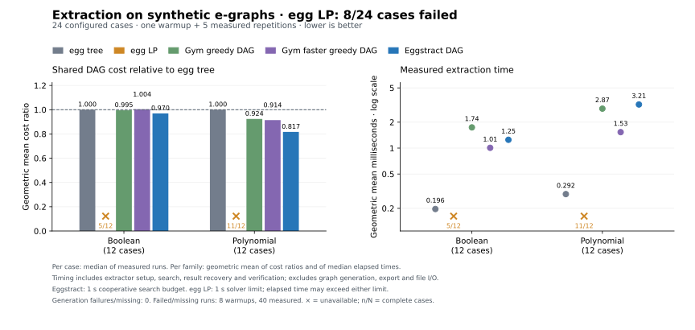

# Eggstract

Extract shared, acyclic DAGs from e-graphs. Eggstract provides a Rust library and
CLI, an optional CP-SAT backend, and a separate experimental memory-bounded
extractor.

| Algorithm | Objective | Use |
|---|---|---|
| Tree seed | Sum of costs with repeated subexpressions counted repeatedly | Fast initial selection |
| DAG search | Sum of selected reachable node costs, counted once | Native heuristic with sharing |
| CP-SAT | The same DAG objective, with integer costs | Optional exact formulation and solver-reported bounds |
| Resident search | Cost per execution under a value-slot limit | Experimental exact solver for small graphs |

The native library has no Python or external solver dependency. The Rust API
uses [`egraph-serialize`](https://crates.io/crates/egraph-serialize) graphs and
explicit requested roots.

## Benchmarks

On 24 synthetic Boolean/polynomial e-graphs, Eggstract DAG used **7.1% fewer
nodes than extraction-gym's faster greedy DAG**, taking **1.6× as long**
(geometric means); it improved 18 cases and tied 6. Compared with egg's tree
extractor, it used **11.0% fewer nodes**, taking **8.4× as long**.



Apple M4 Max; five measured runs per case. All output DAGs were independently
checked. egg LP failed on 8/24 cases, so its aggregate is omitted. These are
synthetic development benchmarks; see [methods and raw results](benchmarks/egg).

## Credit and originality

Eggstract packages implementations and adaptations of established methods,
alongside a locally developed heuristic configuration and an experimental
theorem candidate. It does not claim to have invented every algorithm it exposes.

| Component | Attribution |
|---|---|
| Tree seed | Local implementation of established Dijkstra-style bottom-up extraction |
| DAG search | Configuration developed in the Eggstract research workspace, using established sharing and local-search ideas; no demonstrated novelty claim |
| CP-SAT backend | Local model and driver using Google's [OR-Tools](https://github.com/google/or-tools) solver |
| Resident search | Local implementation of standard shortest-path search; reverse rematerialization is prior work |
| Contextual deletion test | Proposed in an AI research consultation and independently checked locally; historical novelty remains unresolved |

The research workspace included adaptations of
[extraction-gym](https://github.com/egraphs-good/extraction-gym); its MIT notice
is retained in [THIRD_PARTY_NOTICES](THIRD_PARTY_NOTICES).
Implementation lineage, AI assistance, prior-art references and remaining
uncertainty are described in [provenance](docs/provenance.md) and
[the resident-model notes](docs/resident.md).

## Rust

Until a crates.io release, depend on the Git repository:

```toml
[dependencies]
eggstract = { git = "https://github.com/julesjacobs/eggstract" }
```

```rust
use eggstract::{extract, verify, EGraph, Options};

fn optimize(graph: &EGraph) -> Result<(), eggstract::Error> {
    let roots = &graph.root_eclasses;
    let result = extract(graph, roots, &Options::default())?;
    assert_eq!(verify(graph, roots, &result.selected)?, result.cost);
    Ok(())
}
```

`tree_seed(graph, roots)` returns the initial tree-cost selection. `extract`
improves its DAG cost through demand-weighted reconstruction, local replacement,
support exchange, and dependency repair. Both return selected node IDs and the
recomputed DAG cost. Verification checks feasibility against the caller's roots;
it does not certify optimality.

`Options { time_limit, seed }` controls the search. The time limit is cooperative:
the initial seed always completes, and verification runs afterward. The same
seed controls traversal order; a wall-time cutoff can affect the final result.
Costs must be finite and nonnegative. Floating-point search is heuristic.

## Command line

```sh
git clone https://github.com/julesjacobs/eggstract
cd eggstract
cargo run --release --features cli -- extract examples/sharing.json > solution.json
cargo run --release --features cli -- verify examples/sharing.json solution.json
cargo run --example sharing
```

The example costs 8 with the tree seed and 6 when both branches share a value.
Use `--algorithm tree` for the seed, `--time-limit-ms 1000` for the search budget,
and repeated `--root CLASS` flags to override the input graph's roots. Output is
JSON. Invalid inputs and invalid solutions produce a nonzero exit code.

Input is egraph-serialize JSON: nodes have `op`, `eclass`, `children`, and `cost`.
Children are **node IDs**, whose owning classes identify the dependencies.
Selection chooses one representative for each reachable class; it need not
choose the particular child node named in the input. Equivalences are assumed
sound, and costs are supplied by the caller. `subsumed` is serialization metadata;
all supplied nodes remain extraction candidates.

## Optional Python algorithms

```sh
python3 -m venv .venv
. .venv/bin/activate
pip install '.[exact]'
python -m eggstract.exact examples/sharing.json --root R --hint solution.json
```

The CP-SAT backend uses SCC-local ranks to exclude cycles and accepts a verified
incumbent hint. It rejects rounded or unsupported costs. Feasible results are
independently checked; optimality and bounds remain solver reports. See
[the exact backend](docs/exact.md).

`pip install .` installs the dependency-free experimental resident module without
OR-Tools. It charges each operation execution and limits the number of resident
values. It includes exact search, the complete contextual deletion test, and
independent trace and deletion-recipe checking. See
[memory-bounded extraction](docs/resident.md) for its API and assumptions.

## Development

```sh
cargo test --all-features
cargo fmt --check
cargo clippy --all-targets --all-features -- -D warnings
PYTHONPATH=python python3 -m unittest discover -s python/tests -v
```

CP-SAT tests require the `exact` extra. The other Python tests use only the
standard library. CI tests the native library and optional CLI separately, plus
both Python components.

This is an initial source release distilled from a larger research workspace.
It makes no state-of-the-art performance or novelty claim. The resident model
has no spills or target-specific register constraints. Algorithms, limitations,
and source attribution are documented in [the algorithm notes](docs/algorithms.md)
and [provenance](docs/provenance.md). MIT licensed.
